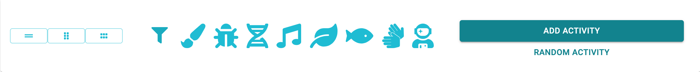
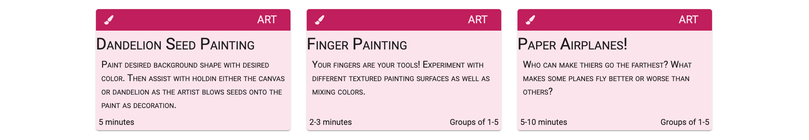
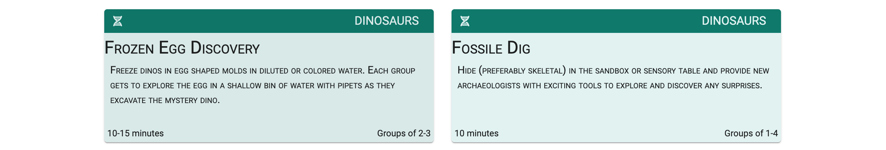
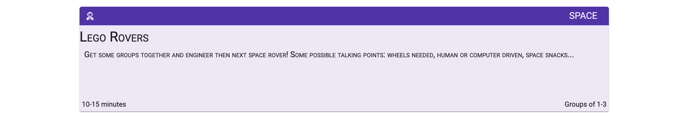
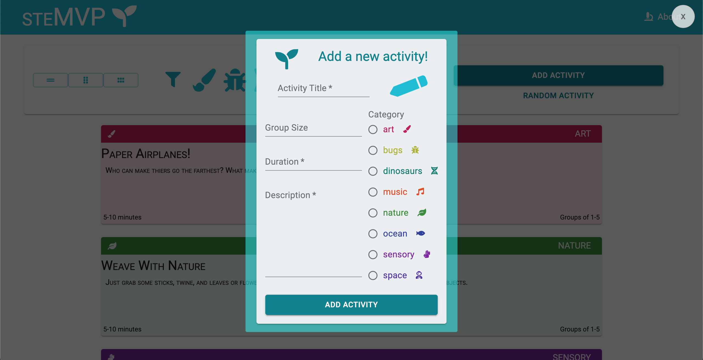

---

## **Description**

A stem lab activity app for ECE teachers.

A group of activities pre-loaded into a postgreSQL database. The user is be able to display all activities or a single random activity. There is also the option to add a new activity, sort activities by category, or select a single random activity from all available.

## **Installation**

1. Fork repo above!

2. Clone repo into desired local directory

3. Navigate into new directory and run `npm install`

4. run `npm start` to connect to the server and `npm run pack` to build the bundle with webpack

5. head to `https://localhost:7676` and **have some fun**!

## **Photos**

- Toolbar with buttons to select _view width_, _activity category_, _add activity_, or grab a _random activity_ if you can't decide.

- Default 3 in a row view

- 2 in a row

- And a single random acivity

- Post activity form

---

### Tech Used

>  >  >  >  >  > 

---

## _Check out the deployed version_ [here](https://stemvp.herokuapp.com/)!
